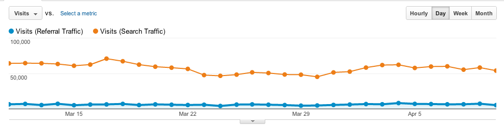

!SLIDE bullets
# Advanced Segments #
 * segments allow you to "slice up" your data
 * google provide some defaults - search traffic, direct traffic
 * can define your own
!SLIDE center bullets
# Search v Referral traffic #

 * Orange line shows search traffic, blue shows referral traffic
!SLIDE bullets
# Custom Variables  #
 * Set your own name value pair variables
 * Set up segments using these
!SLIDE
# 3 Levels #
* Page
    * track site sections 
* Visitor
    * track premium members vs free members
* Session
    * track logged in vs non logged in visitors
!SLIDE
# Slots #
 * Each custom var must be in a slot
 * 5 slots only
 * This does not limit you to 5 variables, just 5 per request
 * google suggest a "slot matrix" to keep track of them
!SLIDE smaller
# Example code #
	@@@ javascript
	_gaq.push(['_setCustomVar',
		1, //Slot #1.  Required parameter.
		'Member Type', // name of custom var. Required parameter.
		'Premium', // value of custom var. Required parameter.
		1 // Sets the scope to visitor-level.  Optional.
	]); 

!SLIDE
# Notes #
 * recommended to keep track of all custom vars used
 * must call before a page view / event is made for it to count
 * very easy to overwrite variables by using the wrong slot, only allowed 5 on a page
 * can do a similar things with event tracking

!SLIDE
# Example - Galleries Carousel #
* Pageviews down after launching ajax galleries
* Carousel was added - could this be the cause?
* Randomly decide if user gets carousel, set custom var

[Report](https://www.google.com/analytics/web/#report/visitors-overview/a11429543w24660150p23109399/%3F_.advseg%3Duser770391837%2Cuser1194204392%26_.date00%3D20111115%26_.date01%3D20111128%26overview-graphOptions.primaryConcept%3Danalytics.pageviews/)
